# lyjoo-TodoList 기술 아키텍처 다이어그램

**버전**: 1.0
**작성일**: 2025-11-26
**상태**: 최종
**작성자**: Claude
**참조 문서**:
- [도메인 정의서](./1-domain-definition.md)
- [PRD](./3-prd.md)
- [프로젝트 구조](./5-project-structure.md)

---

## 목차

1. [전체 시스템 아키텍처](#1-전체-시스템-아키텍처)
2. [클린 아키텍처 레이어 구조](#2-클린-아키텍처-레이어-구조)
3. [프론트엔드 아키텍처](#3-프론트엔드-아키텍처)
4. [백엔드 아키텍처](#4-백엔드-아키텍처)
5. [데이터 흐름](#5-데이터-흐름)
6. [배포 아키텍처](#6-배포-아키텍처)

---

## 1. 전체 시스템 아키텍처

### 1.1 시스템 구성도

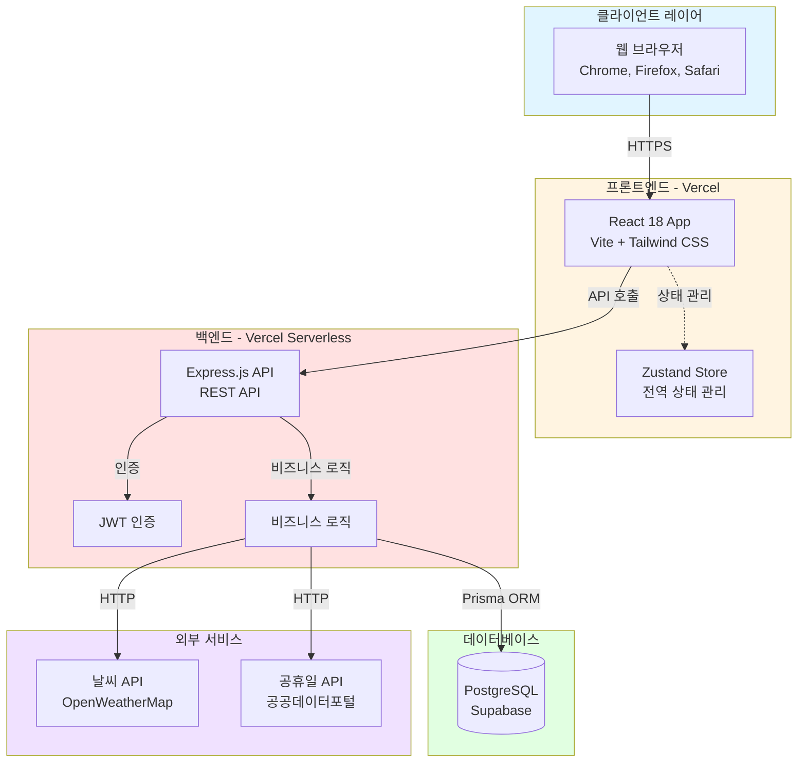

### 1.2 기술 스택 요약

| 레이어 | 기술 | 역할 |
|--------|------|------|
| **프론트엔드** | React 18, Zustand, Tailwind CSS, Vite | 사용자 인터페이스 |
| **백엔드** | Node.js, Express.js, Prisma | API 서버 |
| **데이터베이스** | PostgreSQL (Supabase) | 데이터 저장 |
| **인증** | JWT (jsonwebtoken, bcrypt) | 사용자 인증 |
| **배포** | Vercel (Frontend + Backend) | 호스팅 |
| **외부 API** | OpenWeatherMap, 공공데이터포털 | 날씨, 공휴일 |

### 1.3 상세 라이브러리 목록

#### 프론트엔드 라이브러리

| 라이브러리 | 버전 | 용도 |
|------------|------|------|
| `react` | 18.x | UI 프레임워크 |
| `zustand` | 최신 | 전역 상태 관리 |
| `tailwindcss` | 최신 | 유틸리티 우선 CSS |
| `vite` | 최신 | 빌드 도구 |
| `axios` | 최신 | HTTP 통신 |
| `react-router-dom` | v6 | 라우팅 |
| `react-hook-form` | 최신 | 폼 관리 |
| `zod` | 최신 | 스키마 검증 |
| `date-fns` | 최신 | 날짜 처리 |
| `lucide-react` | 최신 | 아이콘 |

#### 백엔드 라이브러리

| 라이브러리 | 버전 | 용도 |
|------------|------|------|
| `express` | 4.x | 웹 프레임워크 |
| `prisma` | 최신 | ORM |
| `@prisma/client` | 최신 | Prisma 클라이언트 |
| `jsonwebtoken` | 최신 | JWT 인증 |
| `bcrypt` | 최신 | 비밀번호 해싱 |
| `express-validator` | 최신 | 요청 검증 |
| `cors` | 최신 | CORS 설정 |
| `helmet` | 최신 | 보안 헤더 |
| `express-rate-limit` | 최신 | Rate limiting |
| `dotenv` | 최신 | 환경 변수 |

#### 개발 도구

| 도구 | 용도 |
|------|------|
| `eslint` | 코드 린팅 |
| `prettier` | 코드 포맷팅 |
| `typescript` | 타입 체킹 (선택) |
| `postman` / `thunder-client` | API 테스트 |

---

## 2. 클린 아키텍처 레이어 구조

### 2.1 클린 아키텍처 원칙

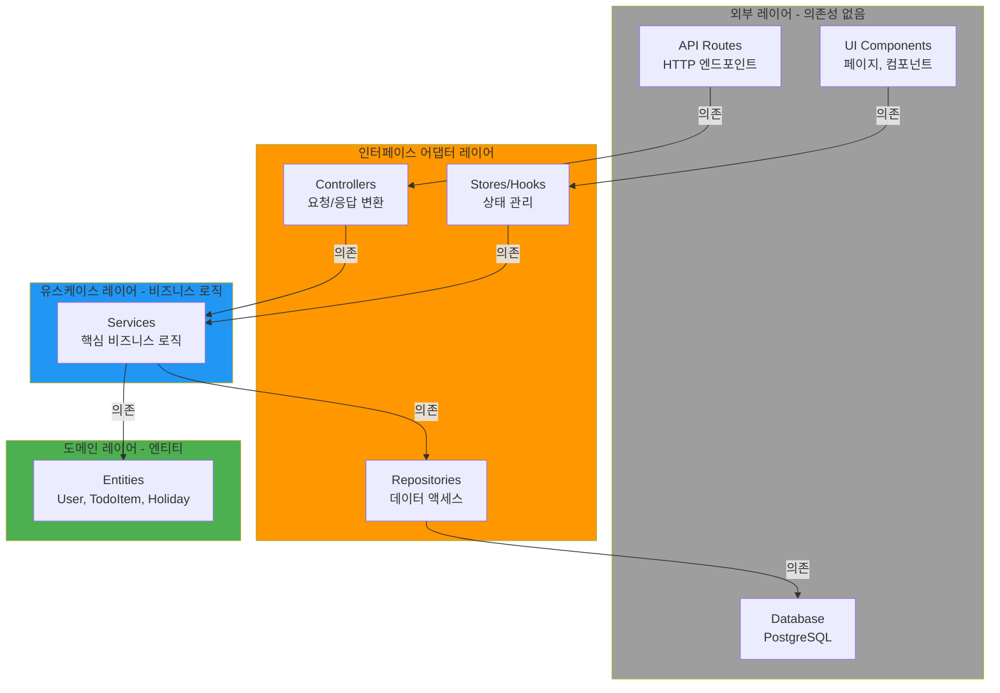

### 2.2 의존성 방향 규칙

**핵심 원칙**: 의존성은 항상 **안쪽(도메인)**으로 향해야 합니다.

```
외부 레이어 → 인터페이스 어댑터 → 유스케이스 → 도메인
     ✅              ✅              ✅
```

**금지 사항**: 역방향 의존성 절대 금지

```
도메인 → 유스케이스 (❌)
유스케이스 → 인터페이스 어댑터 (❌)
```

---

## 3. 프론트엔드 아키텍처

### 3.1 프론트엔드 레이어 구조

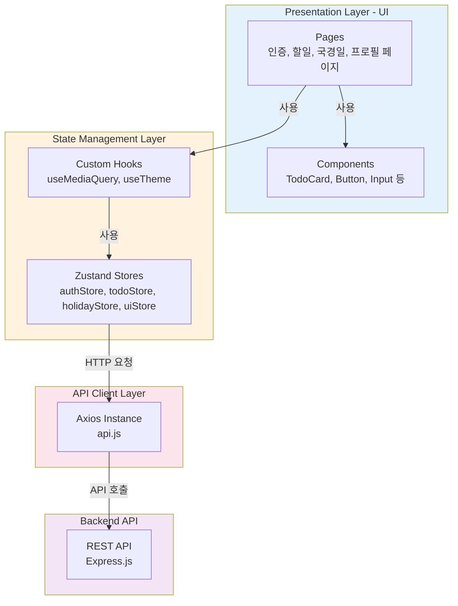

### 3.2 프론트엔드 폴더 구조

```
frontend/src/
├── components/         # 재사용 가능한 컴포넌트
│   ├── auth/           # 인증 관련 컴포넌트
│   ├── common/         # 공통 컴포넌트
│   │   ├── Badge.jsx
│   │   ├── Button.jsx
│   │   ├── Card.jsx
│   │   ├── ConfirmDialog.jsx
│   │   ├── Input.jsx
│   │   ├── Modal.jsx
│   │   ├── Skeleton.jsx
│   │   ├── Spinner.jsx
│   │   └── Toast.jsx
│   ├── layout/         # 레이아웃 컴포넌트
│   │   ├── BottomNav.jsx
│   │   ├── Header.jsx
│   │   ├── MainLayout.jsx
│   │   └── Sidebar.jsx
│   └── todo/           # 할일 관련 컴포넌트
│       ├── TodoCard.jsx
│       ├── TodoFormModal.jsx
│       └── TodoSkeleton.jsx
├── pages/              # 페이지 컴포넌트
│   ├── auth/           # 인증 관련 페이지
│   │   ├── LoginPage.jsx
│   │   └── RegisterPage.jsx
│   ├── holiday/        # 국경일 페이지
│   │   └── HolidayPage.jsx
│   ├── profile/        # 프로필 페이지
│   │   └── ProfilePage.jsx
│   ├── todo/           # 할일 관련 페이지
│   │   ├── TodoListPage.jsx
│   │   └── TrashPage.jsx
│   └── NotFoundPage.jsx
├── store/              # Zustand 스토어
│   ├── todoStore.js
│   ├── authStore.js
│   ├── holidayStore.js
│   └── uiStore.js
├── services/           # API 클라이언트 및 상수
│   ├── api.js
│   └── constants.js
├── hooks/              # 커스텀 훅
│   ├── useMediaQuery.js
│   └── useTheme.js
└── utils/              # 유틸리티 (현재 비어 있음)
```

### 3.3 상태 관리 흐름

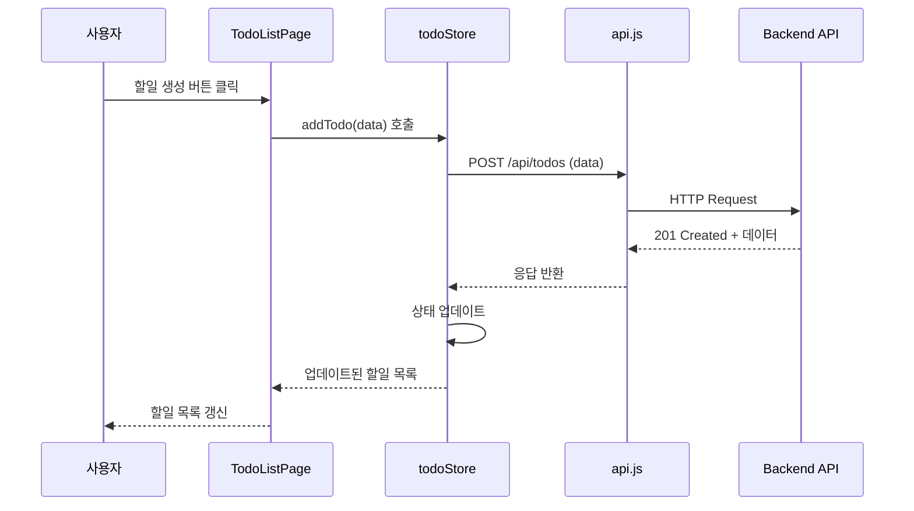

---

## 4. 백엔드 아키텍처

### 4.1 백엔드 레이어 구조 (클린 아키텍처)

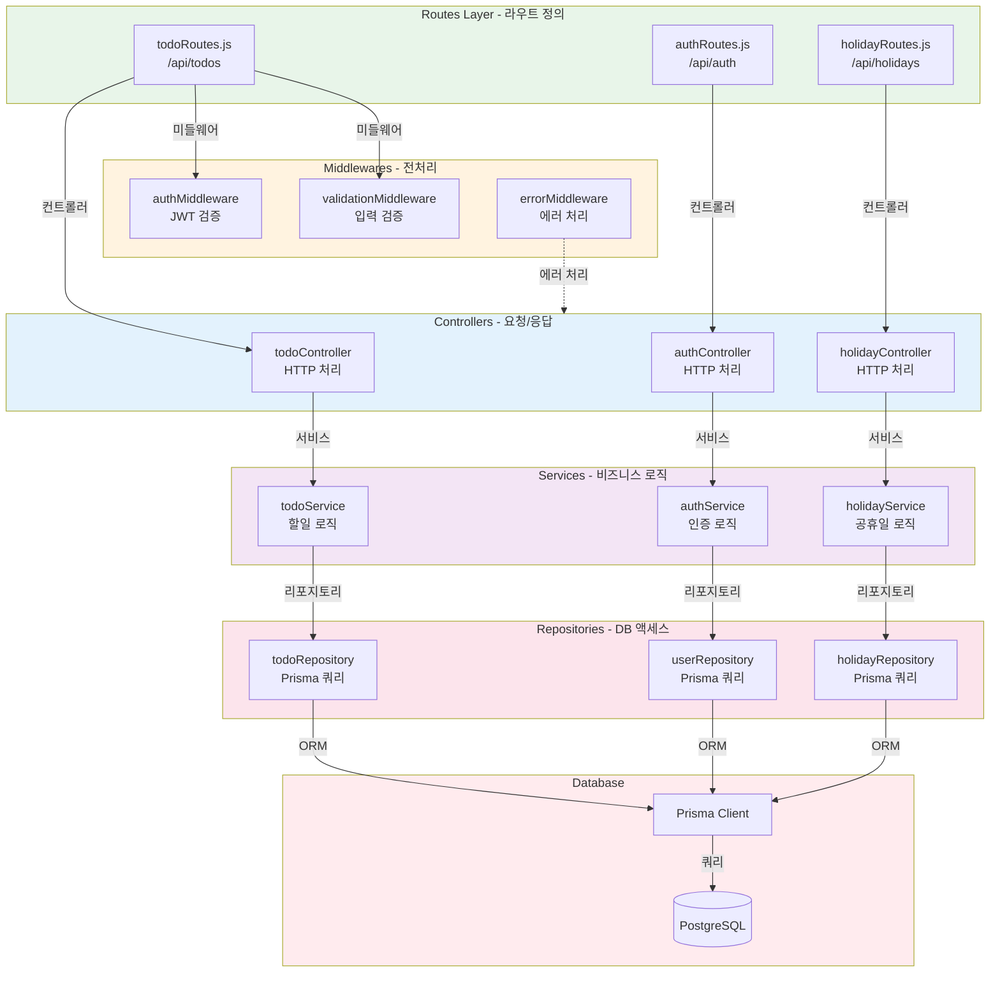

### 4.2 백엔드 폴더 구조 (간소화)

```
backend/src/
├── routes/            # 라우트 정의
│   ├── index.js
│   ├── todoRoutes.js
│   └── authRoutes.js
├── controllers/       # 컨트롤러
│   ├── todoController.js
│   └── authController.js
├── services/          # 비즈니스 로직
│   ├── todoService.js
│   └── authService.js
├── repositories/      # DB 액세스
│   ├── todoRepository.js
│   └── userRepository.js
├── middlewares/       # 미들웨어
│   ├── authMiddleware.js
│   └── errorMiddleware.js
├── utils/             # 유틸리티
│   ├── jwtHelper.js
│   └── passwordHelper.js
├── config/            # 설정
│   ├── database.js
│   └── jwt.js
└── app.js             # Express 설정
```

### 4.3 API 요청 처리 흐름

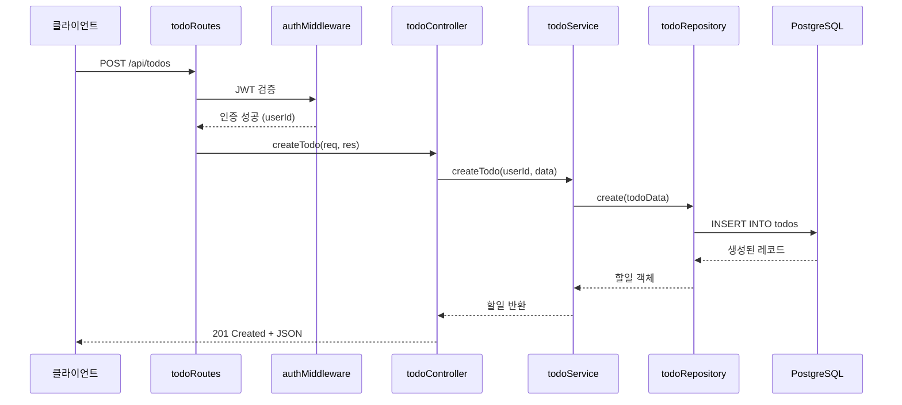

---

## 5. 데이터 흐름

### 5.1 사용자 인증 흐름

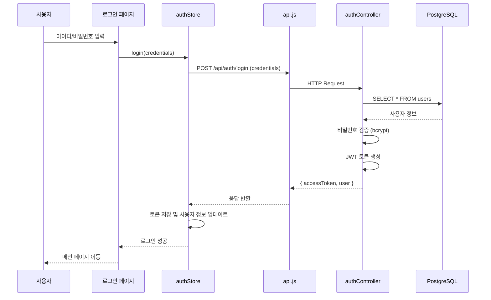

### 5.2 할일 생성 흐름

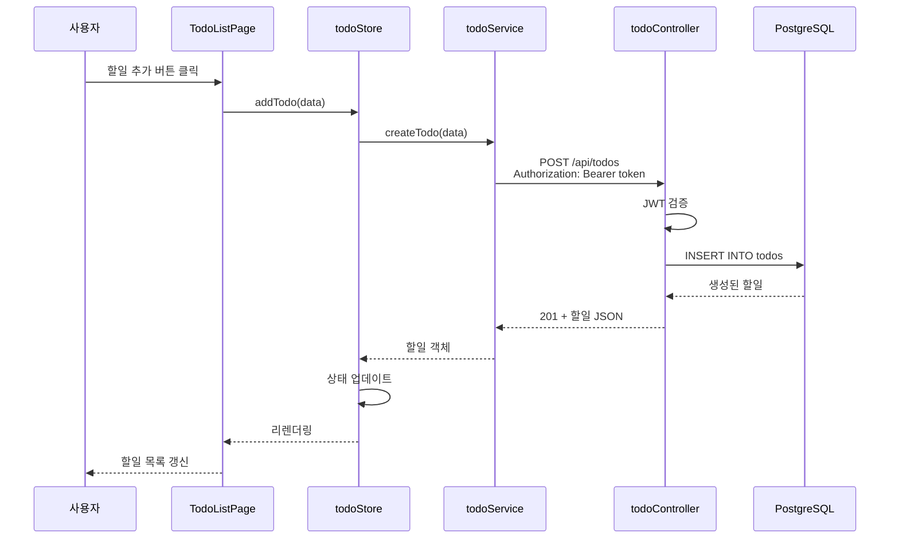


---

## 6. 배포 아키텍처

### 6.1 Vercel 배포 구조

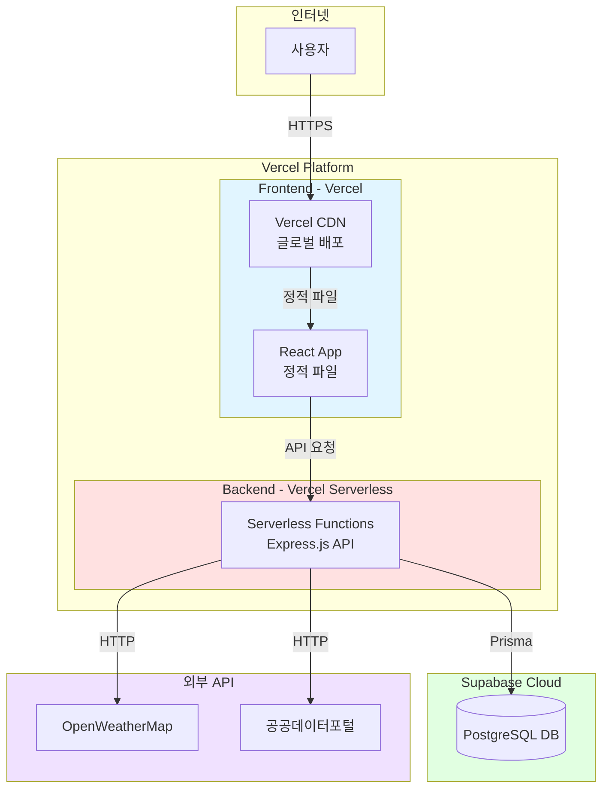

### 6.2 환경 변수 관리

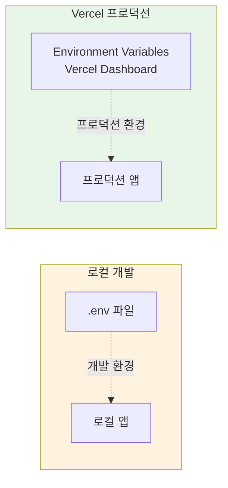

**환경 변수 목록**:

| 변수명 | 용도 | 예시 |
|--------|------|------|
| `DATABASE_URL` | PostgreSQL 연결 문자열 | `postgresql://...` |
| `JWT_SECRET` | JWT 토큰 서명 키 | `random-secret-key` |
| `OPENWEATHERMAP_API_KEY` | 날씨 API 키 | `abcd1234...` |
| `CORS_ORIGIN` | CORS 허용 도메인 | `https://your-app.vercel.app` |

### 6.3 CI/CD 파이프라인 (GitHub Actions)

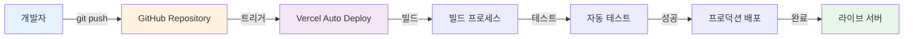

---

## 7. 보안 아키텍처

### 7.1 인증 및 권한 흐름

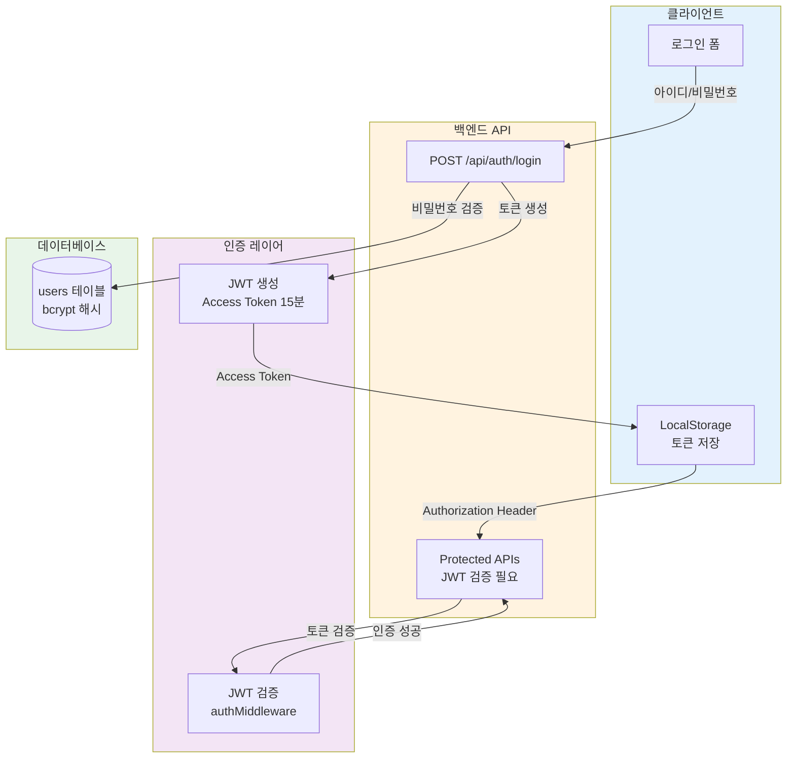

### 7.2 보안 계층

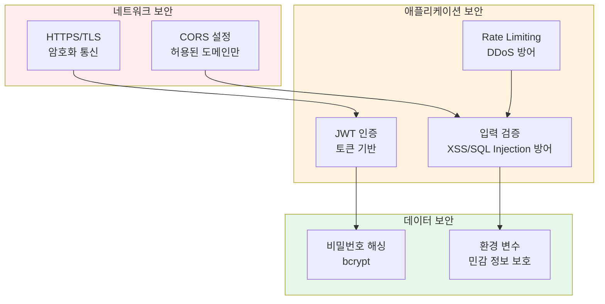

---

## 8. 아키텍처 설계 원칙 요약

### 8.1 핵심 원칙

| 원칙 | 설명 | 적용 사례 |
|------|------|-----------|
| **관심사의 분리** | UI, 비즈니스 로직, 데이터 액세스를 명확히 분리 | Pages ← Stores ← Services ← Repositories |
| **단일 책임** | 각 모듈은 하나의 책임만 가짐 | todoController는 요청/응답만 처리 |
| **의존성 역전** | 상위 레이어가 하위 레이어에 의존 | Controllers → Services → Repositories |
| **DRY** | 중복 코드 제거, 재사용 가능한 컴포넌트/함수 | utils/, hooks/, components/common/ |
| **KISS** | 단순하고 명확한 구조 | 3-tier 아키텍처 (Routes-Services-Repositories) |

### 8.2 레이어별 책임

| 레이어 | 책임 | 금지 사항 |
|--------|------|-----------|
| **UI (Pages/Components)** | 화면 렌더링, 사용자 입력 처리 | ❌ API 직접 호출, 비즈니스 로직 |
| **State (Stores/Hooks)** | 전역 상태 관리, 로직 조율 | ❌ HTTP 통신, DB 액세스 |
| **Service** | API 통신, HTTP 요청/응답 | ❌ UI 렌더링, 상태 직접 변경 |
| **Controllers** | 요청/응답 변환, HTTP 처리 | ❌ 비즈니스 로직, DB 쿼리 |
| **Services (Backend)** | 비즈니스 로직, 유효성 검증 | ❌ HTTP 상세, DB 쿼리 직접 작성 |
| **Repositories** | DB 액세스, Prisma 쿼리 | ❌ 비즈니스 로직, HTTP 처리 |

### 8.3 의존성 규칙

```
프론트엔드: Pages → Hooks/Stores → Services → Backend API
백엔드: Routes → Controllers → Services → Repositories → Database

✅ 상위 → 하위 의존성 (허용)
❌ 하위 → 상위 의존성 (금지)
❌ 순환 의존성 (절대 금지)
```

---

## 9. 참조 문서

- [도메인 정의서](./1-domain-definition.md)
- [PRD](./3-prd.md)
- [프로젝트 구조](./5-project-structure.md)
- [사용자 시나리오](./4-user-scenarios.md)

---

## 10. 변경 이력

| 버전 | 날짜 | 변경 내용 | 작성자 |
|------|------|----------|--------|
| 1.0 | 2025-11-26 | 초안 작성 | Claude |

---

**문서 종료**
