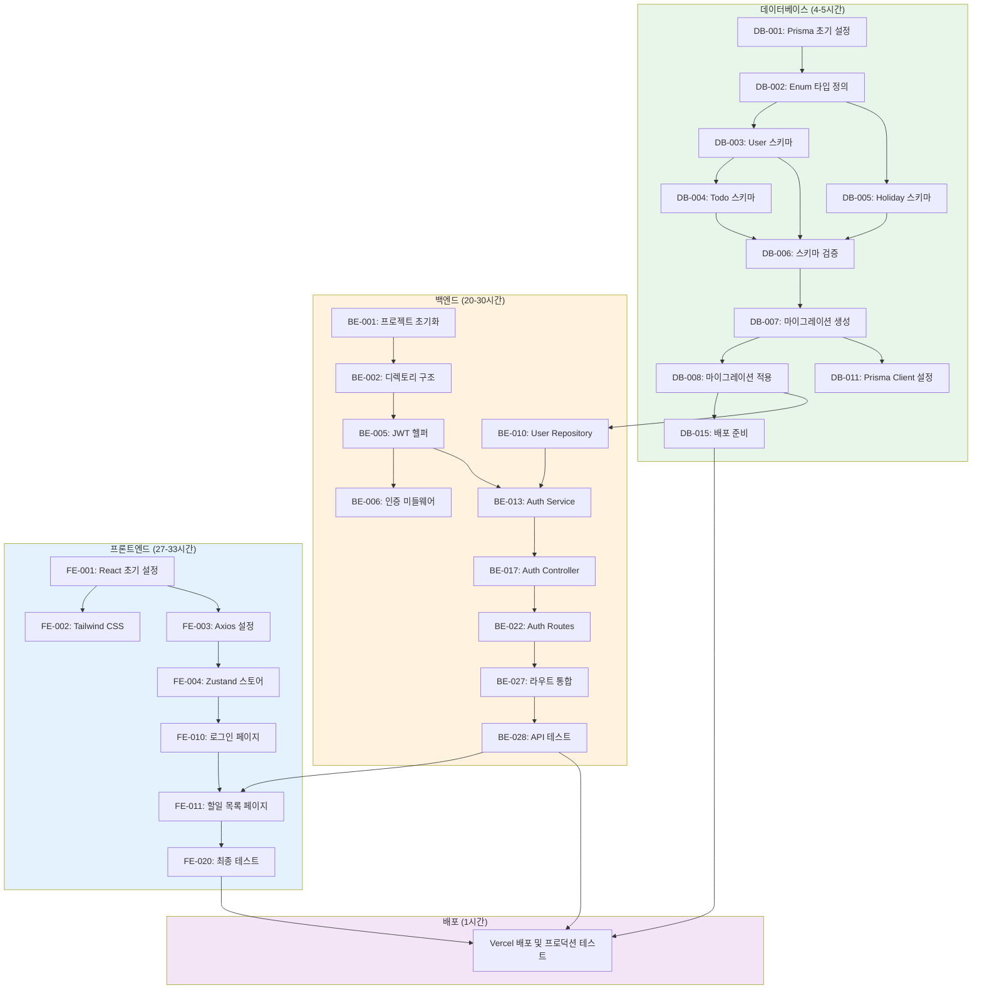

# lyjoo-TodoList 프로젝트 실행계획

**버전**: 1.1
**작성일**: 2025-11-26
**상태**: 최종
**작성자**: Project Manager (Claude)
**프로젝트 기간**: 2025-11-25 ~ 2025-11-28 (4일)

**참조 문서**:
- [PRD](./3-prd.md)
- [아키텍처 다이어그램](./6-arch-diagram.md)
- [ERD](./7-erd.md)

---

## 목차

1. [프로젝트 개요](#1-프로젝트-개요)
2. [전체 일정](#2-전체-일정)
3. [데이터베이스 실행계획](#3-데이터베이스-실행계획)
4. [백엔드 실행계획](#4-백엔드-실행계획)
5. [프론트엔드 실행계획](#5-프론트엔드-실행계획)
6. [의존성 그래프](#6-의존성-그래프)
7. [우선순위 요약](#7-우선순위-요약)
8. [리스크 관리](#8-리스크-관리)

---

## 1. 프로젝트 개요

### 1.1 목표
lyjoo-secure-to-do-list 프로젝트의 MVP(Minimum Viable Product)를 4일 내에 완성하여 프로덕션 배포

### 1.2 기술 스택
- **프론트엔드**: React 18, Vite, Tailwind CSS, Zustand, Axios
- **백엔드**: Node.js 18+, Express.js 4.x, Prisma ORM
- **데이터베이스**: PostgreSQL 15+ (Supabase)
- **배포**: Vercel (Frontend + Backend Serverless)

### 1.3 총 예상 소요 시간
- **데이터베이스**: 4-5시간 (P0: 4시간, P1: 2.25시간)
- **백엔드**: 30시간 (P0: 20시간, P1: 5시간, P2: 5시간)
- **프론트엔드**: 33시간 (P0: 27시간, P1: 10시간)
- **총계**: **약 67시간** (P0만: 51시간)

---

## 2. 전체 일정

### 2.1 Day 1 (2025-11-26, 8시간)
**목표**: 데이터베이스 구축 + 백엔드 초기 설정

| 시간 | Task | 담당 | 우선순위 |
|------|------|------|----------|
| 1시간 | DB-001 ~ DB-003 (Prisma 설정, User 스키마) | DB | P0 |
| 2시간 | DB-004 ~ DB-008 (Todo/Holiday 스키마, 마이그레이션) | DB | P0 |
| 1시간 | DB-009 ~ DB-010 (시드 데이터) | DB | P1 |
| 4시간 | BE-001 ~ BE-009 (프로젝트 초기화, 미들웨어) | Backend | P0 |

### 2.2 Day 2 (2025-11-27, 16시간)
**목표**: 백엔드 API 완성

| 시간 | Task | 담당 | 우선순위 |
|------|------|------|----------|
| 4시간 | BE-010 ~ BE-016 (Repository, Service 레이어) | Backend | P0 |
| 6시간 | BE-017 ~ BE-027 (Controller, Routes) | Backend | P0 |
| 4시간 | BE-028 ~ BE-030 (API 테스트, 문서화) | Backend | P0/P1 |
| 2시간 | 프론트엔드 초기 설정 (FE-001 ~ FE-005) | Frontend | P0 |

### 2.3 Day 3 (2025-11-28 오전, 8시간)
**목표**: 프론트엔드 주요 화면 구현

| 시간 | Task | 담당 | 우선순위 |
|------|------|------|----------|
| 3시간 | FE-006 ~ FE-011 (공통 컴포넌트, 레이아웃) | Frontend | P0 |
| 4시간 | FE-012 ~ FE-018 (인증, 할일, 휴지통 화면) | Frontend | P0 |
| 1시간 | FE-021 ~ FE-023 (API 서비스 레이어) | Frontend | P0 |

### 2.4 Day 4 (2025-11-28 오후, 6시간)
**목표**: 통합 테스트 및 배포

| 시간 | Task | 담당 | 우선순위 |
|------|------|------|----------|
| 2시간 | FE-024 (반응형 디자인) | Frontend | P0 |
| 2시간 | FE-027, FE-030 (에러 처리, 최종 테스트) | Frontend | P0 |
| 1시간 | DB-015, Vercel 배포 설정 | Full Stack | P0 |
| 1시간 | 프로덕션 테스트 및 버그 수정 | Full Stack | P0 |

---

## 3. 데이터베이스 실행계획

### 3.1 데이터베이스 Task 목록

#### DB-001: Prisma 초기 설정
**우선순위**: P0
**예상 소요 시간**: 30분
**의존성**: 없음

**완료 조건**:
- [x] prisma, @prisma/client 패키지 설치 완료
- [x] prisma/ 디렉토리 생성 확인
- [x] .env 파일에 DATABASE_URL 설정 완료
- [x] Supabase 연결 테스트 성공

---

#### DB-002: Enum 타입 정의
**우선순위**: P0
**예상 소요 시간**: 15분
**의존성**: DB-001

**완료 조건**:
- [x] Role enum 정의 완료 (USER, ADMIN)
- [x] TodoStatus enum 정의 완료 (ACTIVE, COMPLETED, DELETED)
- [x] @@map 디렉티브로 DB 테이블명 매핑 확인
- [x] npx prisma format 실행 성공

---

#### DB-003: User 엔티티 스키마 작성
**우선순위**: P0
**예상 소요 시간**: 30분
**의존성**: DB-002

**완료 조건**:
- [x] User 모델의 모든 필드 정의 완료 (7개 필드)
- [x] email 필드에 @unique 제약 설정
- [x] role 필드 기본값 USER로 설정
- [x] @@index([role]) 인덱스 추가
- [x] npx prisma format 실행 후 문법 오류 없음

---

#### DB-004: Todo 엔티티 스키마 작성
**우선순위**: P0
**예상 소요 시간**: 45분
**의존성**: DB-003

**완료 조건**:
- [x] Todo 모델의 모든 필드 정의 완료 (11개 필드)
- [x] userId 외래 키 관계 설정 (onDelete: Cascade)
- [x] @@index([userId, status]) 복합 인덱스 추가
- [x] @@index([dueDate]), @@index([deletedAt]) 인덱스 추가
- [x] status 필드 기본값 ACTIVE, isCompleted 기본값 false 설정

---

#### DB-005: Holiday 엔티티 스키마 작성
**우선순위**: P0
**예상 소요 시간**: 20분
**의존성**: DB-002

**완료 조건**:
- [x] Holiday 모델의 모든 필드 정의 완료 (6개 필드)
- [x] @@index([date]) 인덱스 추가
- [x] isRecurring 필드 기본값 true 설정
- [x] @@map("holidays") 테이블명 매핑 완료
- [x] npx prisma format 실행 후 문법 오류 없음

---

#### DB-006: 스키마 검증 및 포맷팅
**우선순위**: P0
**예상 소요 시간**: 15분
**의존성**: DB-003, DB-004, DB-005

**완료 조건**:
- [x] npx prisma format 실행 성공
- [x] npx prisma validate 실행 성공
- [x] 모든 모델에 주석 추가 완료
- [x] ERD 문서와 스키마 필드 100% 일치 확인
- [x] 스키마 파일 Git 커밋 준비 완료

---

#### DB-007: 초기 마이그레이션 생성
**우선순위**: P0
**예상 소요 시간**: 30분
**의존성**: DB-006

**완료 조건**:
- [x] 마이그레이션 파일 생성 성공
- [x] migration.sql 파일에 3개 테이블 CREATE 문 존재
- [x] 모든 인덱스 및 제약 조건 SQL에 포함 확인
- [x] Prisma Client 자동 생성 완료
- [x] 마이그레이션 히스토리 테이블 생성 확인

---

#### DB-008: 데이터베이스 연결 및 마이그레이션 적용
**우선순위**: P0
**예상 소요 시간**: 20분
**의존성**: DB-007

**완료 조건**:
- [x] Supabase Dashboard에서 3개 테이블 생성 확인
- [x] 각 테이블의 컬럼 및 데이터 타입 일치 확인
- [x] 인덱스 6개 생성 확인
- [x] _prisma_migrations 테이블에 init 마이그레이션 기록 존재
- [x] npx prisma studio 실행으로 데이터베이스 접근 가능

---

#### DB-009: 시드 데이터 스크립트 작성
**우선순위**: P1
**예상 소요 시간**: 45분
**의존성**: DB-008

**완료 조건**:
- [x] prisma/seed.ts 파일 작성 완료
- [x] bcrypt로 비밀번호 해싱 로직 포함
- [x] 관리자 1명, 일반 사용자 2명 데이터 정의
- [x] 샘플 할일 데이터 각 사용자별 2-3개씩 생성
- [x] 2025년 주요 국경일 10개 데이터 정의

---

#### DB-010: 시드 데이터 실행 및 검증
**우선순위**: P1
**예상 소요 시간**: 30분
**의존성**: DB-009

**완료 조건**:
- [x] package.json에 "prisma": { "seed": "..." } 설정 추가
- [x] npx prisma db seed 실행 성공
- [x] users 테이블에 3개 레코드 존재
- [x] todos 테이블에 5-10개 레코드 존재
- [x] holidays 테이블에 10개 레코드 존재

---

#### DB-011: Prisma Client 설정 파일 작성
**우선순위**: P0
**예상 소요 시간**: 20분
**의존성**: DB-007

**완료 조건**:
- [x] database.ts 파일에 Prisma Client 인스턴스 export
- [x] 싱글톤 패턴 적용
- [x] NODE_ENV별 로깅 레벨 설정
- [x] 연결 풀 제한 설정
- [x] 파일에 주석으로 사용법 설명 추가

---

#### DB-012: 데이터베이스 헬퍼 함수 작성
**우선순위**: P1
**예상 소요 시간**: 30분
**의존성**: DB-011

**완료 조건**:
- [x] executeTransaction() 함수 작성
- [x] handlePrismaError() 함수 작성
- [x] paginate() 함수 작성
- [x] 각 함수에 TypeScript 타입 정의 추가
- [x] JSDoc 주석으로 함수 사용법 문서화

---

#### DB-013: 데이터베이스 연결 테스트 작성
**우선순위**: P1
**예상 소요 시간**: 30분
**의존성**: DB-011

**완료 조건**:
- [x] 연결 테스트 성공
- [x] User 생성/조회 테스트 통과
- [x] Todo 생성/조회 테스트 통과
- [x] User-Todo 관계 조회 테스트 통과
- [x] 테스트 실행 후 cleanup 로직 포함

---

#### DB-014: 마이그레이션 문서화
**우선순위**: P1
**예상 소요 시간**: 20분
**의존성**: DB-008

**완료 조건**:
- [x] README에 "데이터베이스 설정" 섹션 추가
- [x] 일반적인 에러 3가지 및 해결 방법 작성
- [x] Supabase 연결 가이드 링크 추가

---

#### DB-015: 프로덕션 배포 준비
**우선순위**: P0
**예상 소요 시간**: 30분
**의존성**: DB-008

**완료 조건**:
- [ ] Vercel Dashboard에 DATABASE_URL 환경 변수 등록
- [x] build 스크립트에 prisma generate && prisma migrate deploy 포함
- [x] .vercelignore에 불필요한 파일 제외 설정
- [x] prisma/migrations/ 폴더 Git 커밋 완료
- [x] 프로덕션 배포 체크리스트 문서 작성

---

## 4. 백엔드 실행계획

### 4.1 백엔드 Phase 1: 프로젝트 초기 설정

#### BE-001: Node.js 프로젝트 초기화
**우선순위**: P0
**예상 소요 시간**: 30분
**의존성**: 없음

**완료 조건**:
- [x] backend/package.json 생성 완료
- [x] express, cors, helmet, dotenv 패키지 설치 완료
- [x] .gitignore에 node_modules, .env 추가 완료
- [x] .env.example 파일 생성
- [x] nodemon 개발 스크립트 추가

---

#### BE-002: 디렉토리 구조 생성 및 기본 Express 앱 설정
**우선순위**: P0
**예상 소요 시간**: 45분
**의존성**: BE-001

**완료 조건**:
- [x] 모든 디렉토리 생성 완료
- [x] app.js에서 Express 앱 생성 및 미들웨어 설정 완료
- [x] server.js에서 서버 시작 로직 작성 완료
- [x] npm run dev로 서버 시작 확인
- [x] GET /health 테스트 엔드포인트 응답 확인

---

#### BE-003: Prisma 초기 설정 및 스키마 작성
**우선순위**: P0
**예상 소요 시간**: 1시간
**의존성**: BE-002

**완료 조건**:
- [x] prisma, @prisma/client 패키지 설치 완료
- [x] prisma/schema.prisma 파일 작성 완료
- [x] .env에 DATABASE_URL 설정 완료
- [x] npx prisma generate 실행 성공
- [x] Prisma Client 임포트 테스트 성공

---

#### BE-004: 데이터베이스 마이그레이션 실행
**우선순위**: P0
**예상 소요 시간**: 30분
**의존성**: BE-003

**완료 조건**:
- [x] DATABASE_URL이 Supabase URL로 정확히 설정됨
- [x] npx prisma migrate dev --name init 실행 성공
- [x] Prisma Studio로 테이블 확인 완료
- [x] users, todos, holidays 테이블 생성 확인
- [x] 인덱스 및 관계 설정 확인

---

### 4.2 백엔드 Phase 2: 유틸리티 및 미들웨어

#### BE-005: JWT 헬퍼 및 비밀번호 헬퍼 구현
**우선순위**: P0
**예상 소요 시간**: 1시간
**의존성**: BE-002

**완료 조건**:
- [x] jsonwebtoken, bcrypt 패키지 설치 완료
- [x] jwtHelper.js에서 generateAccessToken, verifyToken 함수 구현 완료
- [x] passwordHelper.js에서 hashPassword, comparePassword 함수 구현 완료
- [x] .env에 JWT_SECRET, JWT_ACCESS_EXPIRES_IN 설정 완료
- [x] 각 함수 기본 동작 테스트 완료

---

#### BE-006: 인증 미들웨어 구현
**우선순위**: P0
**예상 소요 시간**: 1시간
**의존성**: BE-005

**완료 조건**:
- [x] authMiddleware.js 작성 완료
- [x] Authorization: Bearer {token} 헤더에서 토큰 추출 성공
- [x] jwtHelper.verifyToken으로 토큰 검증 성공
- [x] req.user에 userId, email, role 정보 주입 확인
- [x] 유효하지 않은 토큰 시 401 에러 반환 확인

---

#### BE-007: 에러 핸들링 미들웨어 구현
**우선순위**: P0
**예상 소요 시간**: 45분
**의존성**: BE-002

**완료 조건**:
- [x] errorMiddleware.js 작성 완료
- [x] 에러 응답 형식 통일
- [x] Prisma 에러 처리 확인
- [x] JWT 에러 처리 확인
- [x] app.js 하단에 에러 미들웨어 등록 완료

---

#### BE-008: 요청 검증 미들웨어 설정
**우선순위**: P1
**예상 소요 시간**: 45분
**의존성**: BE-002

**완료 조건**:
- [x] express-validator 패키지 설치 완료
- [x] validationMiddleware.js 작성 완료
- [x] 이메일, 비밀번호, 제목 검증 함수 정의 완료
- [x] 검증 실패 시 400 Bad Request 에러 반환 확인
- [x] 에러 메시지가 명확히 반환되는지 확인

---

#### BE-009: CORS 및 Rate Limiting 미들웨어 설정
**우선순위**: P1
**예상 소요 시간**: 30분
**의존성**: BE-002

**완료 조건**:
- [x] CORS_ORIGIN 환경 변수 설정 완료
- [x] CORS 미들웨어 설정 완료
- [x] express-rate-limit 패키지 설치 완료
- [x] 전역 Rate Limiting 설정 완료 (100 req/min)
- [x] 인증 API Rate Limiting 설정 완료 (10 req/min)

---

### 4.3 백엔드 Phase 3: Repository Layer

#### BE-010: User Repository 구현
**우선순위**: P0
**예상 소요 시간**: 1시간
**의존성**: BE-003

**완료 조건**:
- [x] repositories/userRepository.js 생성
- [x] createUser, findUserByEmail, findUserById 함수 구현
- [x]updateUser 함수 구현 (P1)
- [x] Prisma Client를 사용하여 DB 연동 확인
- [x] 단위 테스트 코드는 생략하되 수동 테스트 가능 상태

#### BE-011: Todo Repository 구현
**우선순위**: P0
**예상 소요 시간**: 1.5시간
**의존성**: BE-003

**완료 조건**:
- [x] repositories/todoRepository.js 생성
- [x] createTodo, findTodosByUserId (필터링 포함) 구현
- [x] findTodoById, updateTodo, deleteTodo (soft delete) 구현
- [x] restoreTodo, deletePermanently (hard delete) 구현
- [x] 트랜잭션 필요 시 적용

#### BE-012: Holiday Repository 구현
**우선순위**: P0
**예상 소요 시간**: 1시간
**의존성**: BE-003

**완료 조건**:
- [x] repositories/holidayRepository.js 생성
- [x] createHoliday, findHolidays (기간 조회) 구현
- [x] updateHoliday, upsertHoliday (동기화용) 구현
- [x] 캐싱된 데이터 조회 로직 확인

---

### 4.4 백엔드 Phase 4: Service Layer

#### BE-013: Auth Service 구현
**우선순위**: P0
**예상 소요 시간**: 2시간
**의존성**: BE-010, BE-005

**완료 조건**:
- [x] services/authService.js 생성
- [x] register: 비밀번호 해싱 후 UserRepo 호출
- [x] login: 비밀번호 검증 후 토큰 발급
- [x] refreshToken: 토큰 재발급 로직
- [x] 중복 이메일 등 예외 처리 로직 포함

#### BE-014: Todo Service 구현
**우선순위**: P0
**예상 소요 시간**: 2시간
**의존성**: BE-011

**완료 조건**:
- [x] services/todoService.js 생성
- [x] getTodos: 검색, 정렬 로직 적용
- [x] createTodo: 날짜 유효성 검사 (dueDate >= startDate)
- [x] updateTodo, deleteTodo: 소유자 권한 확인 로직
- [x] 비즈니스 규칙(BR-12 등) 검증 로직 포함

#### BE-015: Holiday Service 구현
**우선순위**: P0
**예상 소요 시간**: 2시간
**의존성**: BE-012

**완료 조건**:
- [x] services/holidayService.js 생성
- [x] fetchHolidaysFromAPI: 공공데이터포털 API 연동
- [x] syncHolidays: API 데이터를 DB에 저장/갱신
- [x] getHolidays: DB 조회 우선, 데이터 없으면 API 호출 폴백
- [x] axios를 이용한 외부 API 호출 구현

#### BE-016: User Service 구현
**우선순위**: P1
**예상 소요 시간**: 1시간
**의존성**: BE-010

**완료 조건**:
- [x] services/userService.js 생성
- [x] getUserProfile: 사용자 정보 조회 (비밀번호 제외)
- [x] updateUserProfile: 정보 수정 로직
- [x] changePassword: 비밀번호 변경 로직 (선택)

---

### 4.5 백엔드 Phase 5: Controller Layer

#### BE-017: Auth Controller 구현
**우선순위**: P0
**예상 소요 시간**: 1.5시간
**의존성**: BE-013

**완료 조건**:
- [x] controllers/authController.js 생성
- [x] register, login, refresh, logout 핸들러 구현
- [x] req.body 데이터 추출 및 서비스 호출
- [x] 적절한 HTTP 상태 코드 (201, 200, 400, 401) 반환
- [x] 쿠키 또는 바디로 토큰 응답 처리

#### BE-018: Todo Controller 구현
**우선순위**: P0
**예상 소요 시간**: 2시간
**의존성**: BE-014

**완료 조건**:
- [x] controllers/todoController.js 생성
- [x] getTodos, getTodoById, createTodo 핸들러 구현
- [x] updateTodo, deleteTodo, restoreTodo 핸들러 구현
- [x] req.user.userId를 사용하여 소유자 확인
- [x] 에러 발생 시 errorMiddleware로 전달

#### BE-019: Holiday Controller 구현
**우선순위**: P0
**예상 소요 시간**: 1시간
**의존성**: BE-015

**완료 조건**:
- [x] controllers/holidayController.js 생성
- [x] getHolidays 핸들러 구현 (쿼리 파라미터 처리)
- [x] syncHolidays 핸들러 구현 (관리자 전용)
- [x] 외부 API 장애 시 적절한 에러 또는 캐시 데이터 응답

#### BE-020: User Controller 구현
**우선순위**: P1
**예상 소요 시간**: 1시간
**의존성**: BE-016

**완료 조건**:
- [x] controllers/userController.js 생성
- [x] getMe, updateMe 핸들러 구현
- [x] 보안상 민감한 정보(비밀번호 등) 필터링 확인

#### BE-021: Controller 에러 핸들링 래퍼
**우선순위**: P1
**예상 소요 시간**: 30분
**의존성**: BE-007

**완료 조건**:
- [x] utils/asyncHandler.js 생성
- [x] try-catch 블록 중복 제거를 위한 래퍼 함수 구현
- [x] 모든 컨트롤러에 asyncHandler 적용

---

### 4.6 백엔드 Phase 6: Routes Layer

#### BE-022: Auth Routes 설정
**우선순위**: P0
**예상 소요 시간**: 30분
**의존성**: BE-017

**완료 조건**:
- [x] routes/authRoutes.js 생성
- [x] POST /register, /login, /refresh, /logout 라우트 연결
- [x] 입력 값 검증 미들웨어(validationMiddleware) 연결

#### BE-023: Todo Routes 설정
**우선순위**: P0
**예상 소요 시간**: 45분
**의존성**: BE-018

**완료 조건**:
- [x] routes/todoRoutes.js 생성
- [x] GET /todos, POST /todos (authMiddleware 적용)
- [x] GET/PUT/DELETE /todos/:id 라우트 연결
- [x] PATCH /todos/:id/restore 라우트 연결

#### BE-024: Holiday Routes 설정
**우선순위**: P0
**예상 소요 시간**: 30분
**의존성**: BE-019

**완료 조건**:
- [x] routes/holidayRoutes.js 생성
- [x] GET /holidays (인증 필요 여부 확인 - PRD상 공개 가능하나 인증 권장)
- [x] POST /holidays/sync (관리자 권한 미들웨어 필요)

#### BE-025: User Routes 설정
**우선순위**: P1
**예상 소요 시간**: 30분
**의존성**: BE-020

**완료 조건**:
- [x] routes/userRoutes.js 생성
- [x] GET /me, PATCH /me 라우트 연결
- [x] authMiddleware 필수 적용 확인

#### BE-027: 라우트 통합
**우선순위**: P0
**예상 소요 시간**: 30분
**의존성**: BE-022~025

**완료 조건**:
- [x] routes/index.js 생성
- [x] 모든 라우트 모듈 임포트 및 결합
- [x] app.js에 메인 라우터 등록 (app.use('/api', routes))
- [x] 404 Not Found 핸들러 등록

---

### 4.7 백엔드 Phase 7: 통합 테스트

#### BE-028: Postman/Thunder Client API 테스트
**우선순위**: P0
**예상 소요 시간**: 2시간
**의존성**: BE-027

**완료 조건**:
- [x] Postman/Thunder Client 컬렉션 생성 완료
- [x] 회원가입 → 로그인 → 할일 생성 → 조회 플로우 테스트 성공
- [x] 할일 완료 → 삭제 → 휴지통 조회 → 복원 플로우 테스트 성공
- [x] 국경일 조회 테스트 성공
- [x] 에러 케이스 테스트 성공 (401, 403, 404, 409 등)

---

## 5. 프론트엔드 실행계획

### 5.1 프론트엔드 Phase 1: 기반 설정

#### FE-001: React + Vite 프로젝트 초기 설정
**우선순위**: P0
**예상 소요 시간**: 1시간
**의존성**: 없음

**완료 조건**:
- [x] npm create vite@latest frontend -- --template react 실행 완료
- [x] 모든 필수 패키지 설치 완료
- [x] src/ 하위 폴더 구조 생성 완료
- [x] npm run dev로 개발 서버 실행 확인
- [x] ESLint, Prettier 설정 완료

---

#### FE-002: Tailwind CSS 설정
**우선순위**: P0
**예상 소요 시간**: 1시간
**의존성**: FE-001

**완료 조건**:
- [x] Tailwind CSS 설치 완료 및 tailwind.config.js 작성
- [x] 커스텀 색상 정의 (Primary: #00C73C 등)
- [x] 반응형 브레이크포인트 설정
- [x] 다크모드 토글 버튼 생성 및 dark: 클래스 동작 확인
- [x] 간단한 버튼 컴포넌트에 Tailwind 적용 확인

---

#### FE-003: Axios 인스턴스 및 인터셉터 설정
**우선순위**: P0
**예상 소요 시간**: 1시간
**의존성**: FE-001

**완료 조건**:
- [x] Axios 인스턴스 생성 및 baseURL 환경 변수 설정
- [x] 요청 인터셉터에서 accessToken 자동 추가
- [x] 응답 인터셉터에서 401 에러 시 로그아웃 처리
- [x] API_ENDPOINTS 상수 객체 작성
- [x] Postman으로 테스트 API 호출 시 헤더 자동 추가 확인

---

#### FE-004: Zustand 상태 관리 스토어 설정
**우선순위**: P0
**예상 소요 시간**: 2시간
**의존성**: FE-003

**완료 조건**:
- [x] authStore에 user, accessToken, login, logout, checkAuth 액션 구현
- [x] todoStore에 todos 배열, fetchTodos, addTodo, updateTodo, deleteTodo, restoreTodo 액션 구현
- [x] holidayStore에 holidays 배열, fetchHolidays 액션 구현
- [x] uiStore에 isModalOpen, modalType, showToast, isLoading 상태 및 액션 구현
- [x] React DevTools로 Zustand 스토어 상태 변화 확인

---

#### FE-005: React Router 라우팅 설정
**우선순위**: P0
**예상 소요 시간**: 1시간
**의존성**: FE-001

**완료 조건**:
- [x] React Router v6 설치 및 라우트 정의 완료
- [x] ProtectedRoute에서 authStore의 인증 상태 확인
- [x] PublicOnlyRoute에서 이미 로그인된 사용자 리다이렉트
- [x] 각 라우트 경로로 이동 시 해당 페이지 컴포넌트 렌더링 확인
- [x] 404 페이지 표시

---

### 5.2 프론트엔드 Phase 2: UI 컴포넌트 및 레이아웃

#### FE-006: 공통 UI 컴포넌트 개발
**우선순위**: P0
**예상 소요 시간**: 2시간
**의존성**: FE-002

**완료 조건**:
- [x] Button 컴포넌트 (variant: primary, secondary, danger / size: sm, md, lg)
- [x] Input 컴포넌트 (label, error message 지원)
- [x] Card 컴포넌트 (shadow, rounded 스타일)
- [x] Badge 컴포넌트 (상태 표시용)
- [x] Spinner/Skeleton 컴포넌트 (로딩 표시)

#### FE-007: 모달 및 알림 시스템 구현
**우선순위**: P0
**예상 소요 시간**: 1.5시간
**의존성**: FE-004

**완료 조건**:
- [x] Modal 공통 컴포넌트 구현 (Portal 사용)
- [x] ConfirmDialog 컴포넌트 구현
- [x] Toast/Notification 컴포넌트 구현
- [x] uiStore와 연동하여 전역에서 호출 가능 확인

#### FE-008: 레이아웃 컴포넌트 구현
**우선순위**: P0
**예상 소요 시간**: 1.5시간
**의존성**: FE-005

**완료 조건**:
- [x] Header 컴포넌트 (로고, 사용자 메뉴, 로그아웃)
- [x] Sidebar 컴포넌트 (네비게이션 링크 - 데스크톱)
- [x] BottomNav 컴포넌트 (모바일 전용)
- [x] MainLayout 컴포넌트 (Header + Sidebar/BottomNav + Outlet)
- [x] **useMediaQuery 훅 구현 및 반응형 분기 처리**
- [x] 반응형 동작 확인

#### FE-009: 아이콘 및 테마 설정
**우선순위**: P1
**예상 소요 시간**: 1시간
**의존성**: FE-002

**완료 조건**:
- [x] lucide-react 설치 및 주요 아이콘 선정
- [x] ThemeProvider 구현 (다크모드 Context) - useTheme hook으로 대체
- [x] 다크모드 색상 팔레트 점검 및 적용

---

### 5.3 프론트엔드 Phase 3: 기능 구현

#### FE-010: 회원가입 및 로그인 페이지
**우선순위**: P0
**예상 소요 시간**: 2시간
**의존성**: FE-003, FE-004

**완료 조건**:
- [x] LoginPage 구현 (이메일/비밀번호 폼)
- [x] RegisterPage 구현 (이름, 이메일, 비밀번호, 확인)
- [x] React Hook Form + Zod 유효성 검사 적용
- [x] 로그인 성공 시 토큰 저장 및 메인 이동 확인
- [x] 에러 메시지 표시 (Toast 연동)

#### FE-011: 할일 목록 페이지 (메인)
**우선순위**: P0
**예상 소요 시간**: 3시간
**의존성**: FE-006, FE-004

**완료 조건**:
- [x] TodoListPage 구현
- [x] TodoCard 컴포넌트 구현 (제목, 날짜, 상태 표시)
- [x] 목록 필터링 UI (전체, 진행중, 완료)
- [x] 날짜별 그룹화 표시 (오늘, 내일, 그 외)
- [x] 데이터 로딩 중 Skeleton 표시

#### FE-012: 할일 상세 및 수정 (모달)
**우선순위**: P0
**예상 소요 시간**: 2시간
**의존성**: FE-007, FE-011

**완료 조건**:
- [x] TodoFormModal 구현 (생성/수정 공용)
- [x] 날짜 선택기 (Date Picker) 적용
- [x] 할일 클릭 시 수정 모달 오픈
- [x] 수정 사항 저장 후 목록 자동 갱신

#### FE-013: 할일 상태 관리 기능
**우선순위**: P0
**예상 소요 시간**: 1.5시간
**의존성**: FE-011

**완료 조건**:
- [x] 할일 완료 토글 기능 (체크박스)
- [x] 할일 삭제 기능 (휴지통 이동 - ConfirmDialog)
- [x] 낙관적 업데이트(Optimistic Update) 적용 고려
- [x] 상태 변경 시 애니메이션 효과
- [x] **canvas-confetti 설치 및 Fireworks 컴포넌트 구현**
- [x] **오늘 할일 모두 완료 시 폭죽 효과 실행 로직 구현**

#### FE-014: 휴지통 페이지
**우선순위**: P0
**예상 소요 시간**: 1.5시간
**의존성**: FE-005

**완료 조건**:
- [x] TrashPage 구현 (삭제된 할일 목록)
- [x] 복원 버튼 기능 구현
- [x] 영구 삭제 버튼 기능 구현 (경고창 포함)

#### FE-015: 국경일 페이지 및 표시
**우선순위**: P0
**예상 소요 시간**: 1.5시간
**의존성**: FE-004

**완료 조건**:
- [x] HolidayPage 구현 (국경일 목록)
- [x] 할일 목록 페이지 상단에 '오늘의 국경일' 배너 표시
- [x] 달력 뷰 (P2) 대신 리스트 뷰로 우선 구현

#### FE-016: 프로필 페이지
**우선순위**: P1
**예상 소요 시간**: 1시간
**의존성**: FE-004

**완료 조건**:
- [x] ProfilePage 구현
- [x] 내 정보 조회 및 표시
- [x] 정보 수정 폼 구현
- [x] 비밀번호 변경 폼 구현

---

### 5.4 프론트엔드 Phase 4: 통합 및 최적화

#### FE-017: 프론트-백엔드 연동 점검
**우선순위**: P0
**예상 소요 시간**: 2시간
**의존성**: All BE & FE Tasks

**완료 조건**:
- [x] 모든 API 호출 정상 동작 확인 (백엔드 연동 후 테스트 필요)
- [x] 토큰 만료 시 자동 로그아웃/갱신 처리 확인
- [x] 네트워크 에러 시 사용자 피드백 확인
- [x] CORS 이슈 없음 확인 (백엔드 연동 후 테스트 필요)

#### FE-018: 반응형 디자인 점검
**우선순위**: P0
**예상 소요 시간**: 2시간
**의존성**: FE-008

**완료 조건**:
- [x] 모바일(375px), 태블릿(768px), 데스크톱(1024px) 해상도 점검
- [x] 모바일 네비게이션 동작 확인
- [x] 터치 영역 크기 적절성 확인

#### FE-019: 다크모드 및 스타일 폴리싱
**우선순위**: P1
**예상 소요 시간**: 1.5시간
**의존성**: FE-009

**완료 조건**:
- [x] 모든 페이지 다크모드 적용 확인
- [x] 색상 대비 접근성 준수 확인
- [x] hover, active, focus 상태 스타일 점검

#### FE-020: 최종 테스트 및 버그 수정
**우선순위**: P0
**예상 소요 시간**: 3시간
**의존성**: All Tasks

**완료 조건**:
- [x] 주요 유저 시나리오(가입~삭제) E2E 테스트 수행 (백엔드 연동 후 테스트 필요)
- [x] 발견된 크리티컬 버그 수정
- [x] 콘솔 에러/워닝 제거
- [x] 불필요한 console.log 제거

---

## 6. 의존성 그래프

---

## 7. 우선순위 요약

### 7.1 P0 (Must-have - MVP 필수, 총 51시간)

**데이터베이스 (4시간)**:
- DB-001 ~ DB-008 (Prisma 설정, 스키마 작성, 마이그레이션)
- DB-011 (Prisma Client 설정)
- DB-015 (배포 준비)

**백엔드 (20시간)**:
- BE-001 ~ BE-007 (초기 설정, 미들웨어)
- BE-010 ~ BE-015 (Repository, Service)
- BE-017 ~ BE-027 (Controller, Routes)
- BE-028 (API 테스트)

**프론트엔드 (27시간)**:
- FE-001 ~ FE-008 (기반 설정, 공통 컴포넌트)
- FE-010 ~ FE-015 (인증, 할일, 휴지통, 국경일)
- FE-017, FE-018 (연동, 반응형)
- FE-020 (최종 테스트)

### 7.2 P1 (Should-have - 시간 여유 시 구현, 총 16시간)

**데이터베이스 (2.25시간)**:
- DB-009 ~ DB-010 (시드 데이터)
- DB-012 ~ DB-014 (헬퍼, 테스트, 문서화)

**백엔드 (5시간)**:
- BE-008 ~ BE-009 (검증, Rate Limiting)
- BE-016 (User Service)
- BE-020 (User Controller)
- BE-025 (User Routes)

**프론트엔드 (10시간)**:
- FE-009 (테마/아이콘)
- FE-016 (프로필 페이지)
- FE-019 (다크모드 폴리싱)

### 7.3 P2 (Nice-to-have - 2차 개발, 총 5시간)

**백엔드 (5시간)**:
- BE-026 (문서화)
- 공휴일 자동 동기화 스케줄러

---

## 8. 리스크 관리

### 8.1 기술적 리스크

| 리스크 | 영향도 | 확률 | 완화 전략 |
|--------|--------|------|-----------|
| **Prisma + Supabase 연결 실패** | High | Medium | IP 화이트리스트 확인, 연결 문자열 재확인 |
| **JWT 토큰 관리 복잡도** | Medium | Medium | Refresh Token은 2차 개발로 후순위 처리 |
| **Zustand 학습 곡선** | Medium | Low | 공식 문서 예제 우선 참고, 단순한 구조로 시작 |
| **반응형 디자인 복잡도** | Medium | Medium | Tailwind 모바일 우선 클래스 활용 |
| **API 통합 이슈** | High | Medium | Mock 데이터로 먼저 UI 구현 후 API 연동 |

### 8.2 일정 리스크

| 리스크 | 대응 방안 |
|--------|-----------|
| **프론트엔드 개발 지연** | P1 기능(다크모드, 필터, 프로필) 제외 |
| **API 통합 이슈** | API 명세 사전 합의, Mock 데이터 활용 |
| **배포 설정 시간 초과** | Vercel 템플릿 활용, 배포 가이드 사전 숙지 |
| **예상치 못한 버그** | 각 Phase마다 2-4시간 버퍼 포함 |

### 8.3 외부 의존성

| 의존성 | 리스크 | 대응 방안 |
|--------|--------|-----------| | **Supabase 서비스** | 서비스 다운타임 | 로컬 PostgreSQL 백업 환경 구축 |
| **Vercel 배포** | 배포 실패 | 로컬 테스트 철저히, Vercel 로그 확인 |
| **외부 API** | API 장애 | 캐시된 데이터 사용, P2로 후순위 처리 |

---

## 9. 최종 체크리스트

### 9.1 데이터베이스 완료 후
- [ ] Supabase Dashboard에서 3개 테이블 존재 확인
- [ ] npx prisma studio 실행 및 데이터 시각화 성공
- [x] Prisma Client 코드에서 모델 import 가능 확인
- [x] 시드 데이터 정상 삽입 확인
- [x] 마이그레이션 파일 Git 커밋 완료

### 9.2 백엔드 완료 후
- [x] 모든 API 엔드포인트 Postman/Thunder Client 테스트 통과
- [x] 회원가입 → 로그인 → 할일 CRUD 플로우 정상 동작
- [x] 에러 처리 (401, 403, 404, 409) 정상 동작
- [x] JWT 인증 미들웨어 정상 동작
- [x] README.md 작성 완료

### 9.3 프론트엔드 완료 후
- [x] 로그인 → 할일 추가 → 수정 → 완료 → 삭제 → 복원 플로우 정상 동작
- [ ] Chrome, Firefox, Safari, Edge에서 모든 페이지 정상 렌더링
- [x] 모바일 반응형 디자인 확인 (iPhone, Android)
- [x] 모든 API 호출 성공 및 에러 처리 정상 동작
- [ ] Lighthouse 성능 점수 80점 이상

### 9.4 배포 전 확인
- [ ] Vercel 환경 변수 DATABASE_URL 설정 완료
- [x] package.json 빌드 스크립트 수정 완료
- [ ] Supabase 프로덕션 DB 백업 설정 확인
- [x] 로컬과 프로덕션 스키마 일치 확인
- [x] 프로덕션 배포 체크리스트 문서 작성

---

## 10. 참조 파일 경로

**프로젝트 루트**: `C:\Users\student\lyjoo-Secure-To-Do-List\`

**주요 디렉토리**:
- `backend/` - 백엔드 소스 코드
- `frontend/` - 프론트엔드 소스 코드
- `doc/` - 프로젝트 문서
- `database/` - 데이터베이스 스크립트

**문서**:
- `doc/3-prd.md` - PRD
- `doc/6-arch-diagram.md` - 아키텍처 다이어그램
- `doc/7-erd.md` - ERD
- `doc/8-execution-plan.md` - 본 실행계획 문서

---

**문서 작성 완료**: 2025-11-26
**작성자**: Project Manager (Claude)
**총 Task 수**: 83개 (DB: 15, BE: 28, FE: 20 + 세부)
**예상 총 소요 시간**: 67시간 (P0만: 51시간)